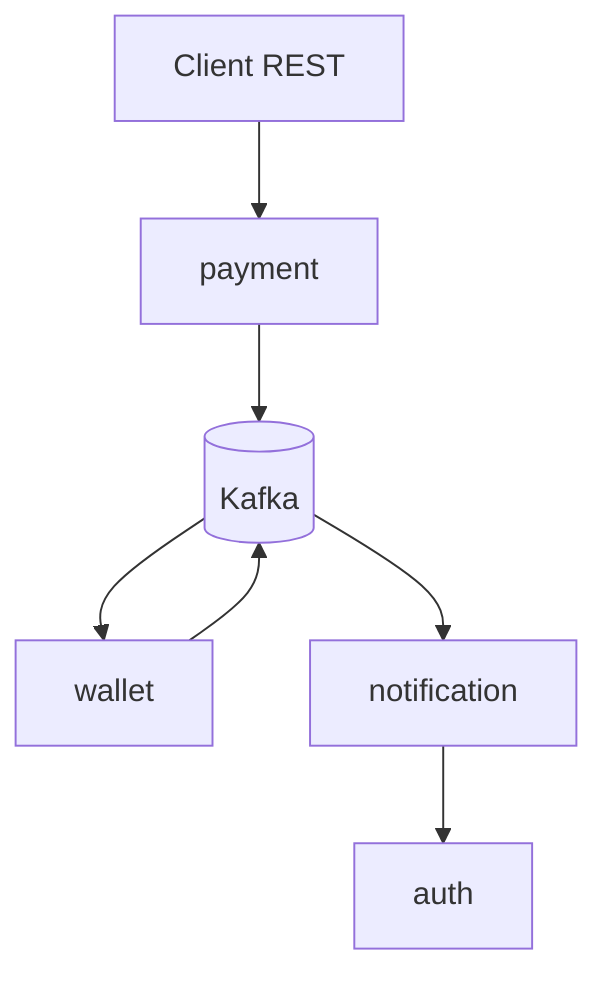

# Fairroll

Distributed Event-Driven payment platform focused on performance engineering.

The project starts with a deliberately naive architecture and evolves through load testing, profiling, bottleneck analysis, and measured optimization.

No premature optimization. Every improvement must be justified by data.

## Principles

- Build first
- Measure second
- Optimize third

## Initial Constraints

### PostgreSQL

- No secondary indexes
- No partitioning
- No read replicas

### Kafka

- Single broker
- Single partition topics
- Replication factor = 1

### Application

- No Redis
- No caching
- No CQRS
- No horizontal scaling

## Architecture

## Stack

- Go
- PostgreSQL
- Kafka
- Franz-go
- Docker
- Prometheus
- Grafana
